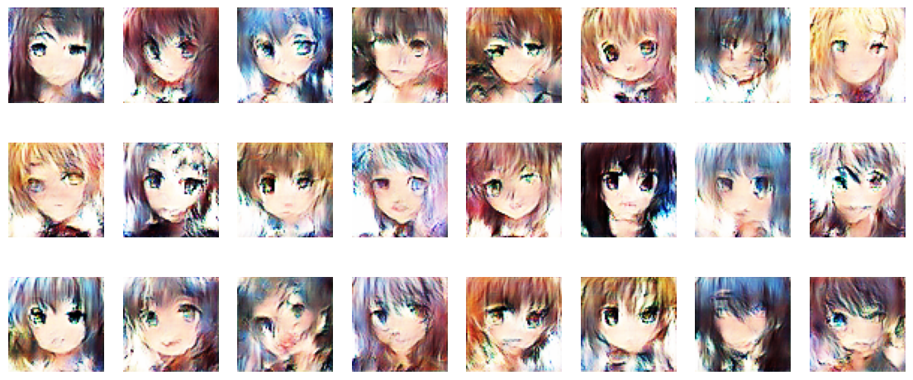
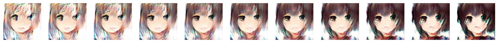

   <h1>Anime Face Generation</h1>

<blockquote>
  
“A generative adversarial model is a powerful machine learning technique where two neural networks compete against each other in a zero-sum game, leading to the creation of new, synthetic data that is indistinguishable from real data.”

</blockquote>

------

- **[Introduction](#Introduction)**
  
- **[DCGAN](#DCGAN)**

- **[Pre-Trained Models](#Pre-Trained-Models)**
- **[Results](#Results)**
  
- **[Author](#Author)**

------

## Introduction

The objective of this project is to use the following Kaggle [dataset](https://www.kaggle.com/datasets/soumikrakshit/anime-faces), in order to generate anime faces using a Deep Convolutional Generative Adversarial Network (DCGAN).

## DCGAN

A Deep Convolutional Generative Adversarial Network (DCGAN) is a generative model that consists of two main components: a **generator network** and a **discriminator network**. The generator network takes in a random noise vector and outputs a synthetic image, while the discriminator network takes in both real and synthetic images and outputs a probability that the input image is real. The two networks are trained in a zero-sum game, where the generator tries to generate synthetic images that are indistinguishable from real images, while the discriminator tries to correctly identify real and synthetic images.

The generator network can be represented mathematically as a function `G(z)` where `z` is a random noise vector and `G` outputs a synthetic image. The discriminator network can be represented as a function `D(x)` where `x` is an input image and `D` outputs a probability that `x` is a real image. The objective of the DCGAN is to find the Nash equilibrium of the following minimax game:

$min_G max_D V(D,G) = E_{x\sim p_{data}(x)}[log(D(x))] + E_{z\sim p_z(z)}[log(1 - D(G(z)))]$

where $p_{data}(x)$ is the distribution of real images and $p_z(z)$ is the distribution of the random noise vectors. The generator is trained to minimize this objective, while the discriminator is trained to maximize it. By alternating the training of the generator and discriminator, the DCGAN can eventually converge to a solution where the synthetic images generated by the generator are indistinguishable from real images.

## Pre-Trained Models

Pre-trained models are located inside the `./checkpoint` folder. They were trained on an **NVIDIA GeForce MX110 GPU**.

| Name   | Time    | Epochs |
| ------ | ------- | ------ |
| afg.pt | 6 hours | 33     |

## Results

Below are some images generated from a model that has been trained for 33:

The following is an example of interpolation between two generated images:

## Author

[Seminara Luigi](https://github.com/Gigi-G)
